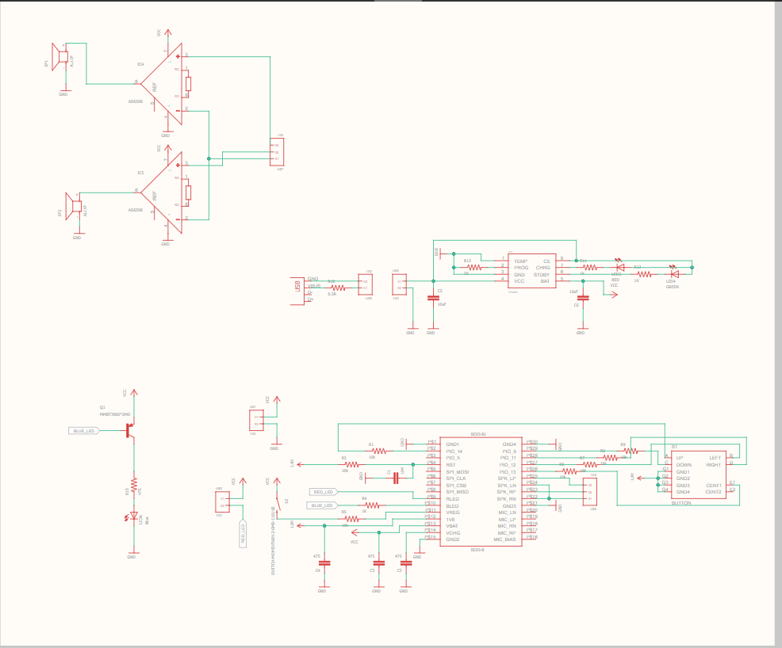
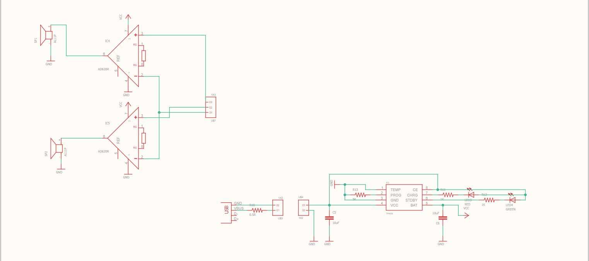
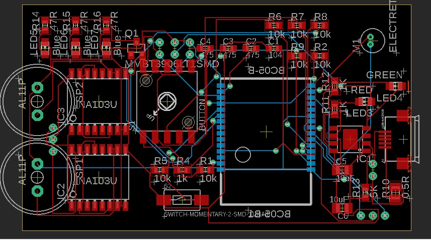

# Grand-Challenge-Speaker
The main objective of this grand challenge was to energize young minds and develop indigenous innovative 
commercially viable product designs which can be up- scaled further under a Centre of Excellence being 
setup by Centre for Development of Advanced Computing (CDAC).
# P-004: To design low-cost Bluetooth Speaker
Wireless speakers are loudspeakers that receive audio signals using radio frequency (RF) waves
rather than over audio cables. Bluetooth technology is used to transmit audio data to the receiving
speaker. Expected features are easy pairing and noise cancellation.

### Speaker Full Schematic
</img>

### Speaker Main Schematic
</img>

### Speaker Charging + Speaker Schematic
</img>

## PCB Design 
</img>
